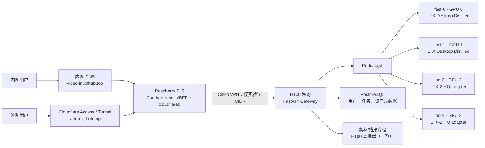

# Oneiroi Studio 开题计划

> 版本：v0.3（2026-07-29）  
> 产品品牌：**Oneiroi Studio**（读作“欧-奈-罗伊”；希腊神话中的梦神群体）  
> GitHub 仓库：`xjuIcthub/oneiroi-studio`  
> 定位：面向两位内部用户的私有图生视频创作平台。以 [LTX Desktop](https://github.com/Lightricks/LTX-Desktop) 的本地推理能力为基础，提供一套“Notion 式轻量工作台 + 对话式多模态创作”的浏览器 WebUI。视觉系统参考 [xju-feiyue](https://github.com/xjuIcthub/xju-feiyue)，功能信息架构参考 [即梦 AI 首页](https://jimeng.jianying.com/ai-tool/home)；不复刻任一第三方的名称、Logo、文案、插画、截图或源代码。

## 品牌命名约定

- **对外产品名**：Oneiroi Studio；页面标题、登录页、文档和未来套餐均使用此名称。
- **技术基座**：LTX-2 / LTX Desktop 仅在“模型与许可证说明”中作为开源依赖提及，不作为产品名称、Logo 或暗示官方合作的标识。
- **系列预留**：Oneiroi 是未来 Mousai 工具系列中的创作产品；本期开题只建设 Oneiroi Studio，不预设其他产品的实现范围。

## 1. 项目背景与目标

实验室有 8 卡 H100 服务器。本项目先使用其中 4 卡，结合一台 8 核 16 GB Raspberry Pi 5（Ubuntu 24 Desktop）构建一个可从内网和互联网安全访问的 LTX-2 图生视频服务。

第一阶段只解决最核心的创作闭环：**上传参考图片 + 输入提示词 → 选择生成规格 → 排队生成视频 → 在线预览、下载、复用参数**。它不是通用视频编辑器，也不把 ComfyUI 工作流暴露给最终用户。

### 1.1 成功标准

- 两位授权用户可分别通过内网和外网访问同一套 WebUI。
- 默认图生视频任务可同时占用 GPU 0、1；高质量任务可同时占用 GPU 2、3，任务互不串结果。
- 用户能看到任务排队、加载模型、推理、编码、完成或失败等状态，而不是长时间“转圈”。
- 输出视频、输入素材、提示词和可复用参数形成用户私有资产库。
- H100 的 SSH、推理 Worker、Redis、数据库均不直接暴露到公网。

### 1.2 第一阶段范围

| 范围 | 纳入 | 不纳入 |
| --- | --- | --- |
| 生成 | 单图参考 + 文字提示词的 I2V；预置比例、分辨率、时长；种子；快速/高质量档 | 任意数量参考素材、音频驱动、角色训练、批量生产 |
| 体验 | 创作对话页、任务卡、历史会话、资产库、结果预览/下载、参数复用 | 完整非编时间线、协作评论、付费/积分 |
| 账户 | 两位受控用户、Cloudflare Access 身份校验、最小权限 | 公共注册、开放分享、商业化支付 |
| 运维 | 四 Worker 调度、日志、健康检查、备份、内部 ComfyUI 调试入口 | 跨机房高可用、自动弹性扩缩容 |

## 2. 总体技术路线

### 2.1 选型结论

- **推理能力基座：LTX Desktop。** 复用其 LTX 本地模型管理、Distilled 快速管线、LoRA / IC-LoRA、提示词增强、Retake 等已实现能力；不把 Electron 桌面壳作为最终 Web 前端。
- **高质量管线：官方 LTX-2 `TI2VidTwoStagesHQPipeline` 适配器。** LTX Desktop 当前本地常规生成路径偏向 Distilled 快速管线，高质量队列单独封装，避免将“Pro”名称误当作本地高质量模型。
- **用户 WebUI：Next.js + React + TypeScript。** 独立开发，采用“Notion 浅色、文档化、低装饰”的视觉系统，以及“灵感 / 生成 / 资产”的创作信息架构；使用 Tailwind CSS、shadcn/ui、Zustand、TanStack Query 和 SSE。
- **服务协调：FastAPI Gateway + Redis 队列 + PostgreSQL。** Gateway 是浏览器唯一可见的应用 API；每张 GPU 是一个独立、固定 GPU 的推理 Runner。
- **入口机：Raspberry Pi 5。** 承担 Caddy、`cloudflared`、Next.js/BFF，不承担任何模型推理或大文件长期存储。

### 2.2 架构图



## 3. 域名、网络与访问策略

### 3.1 双域名设计

| 场景 | 访问域名 | DNS 记录/解析位置 | 最终目标 |
| --- | --- | --- | --- |
| 实验室内网 | `video-in.icthub.top` | 实验室内部 DNS；A/AAAA 指向树莓派在工作区/可达网段的私网地址 | Pi 上的 Caddy / Next.js |
| 外网 | `video.icthub.top` | Cloudflare DNS；由 Named Tunnel 创建 CNAME 指向 Tunnel | Cloudflare Tunnel → Pi 上的 Caddy / Next.js |

两个域名提供同一 Web 应用，但必须作为两个受信任 Origin 分别配置 Cookie、CORS、Content-Security-Policy 和回调地址。默认不做从内网域名跳转到外网域名，避免实验室访问绕回公网。

### 3.2 Cisco VPN 与路由原则

- Raspberry Pi 用 Cisco 官方认可客户端或 OpenConnect 连接实验室 VPN；仅为 H100、内部 DNS、必要存储服务下发实验室 CIDR 路由。
- 工作区 Wi-Fi 保持默认路由，Cloudflare Tunnel 的出站连接仍走 Wi-Fi；**Cisco 不是二层桥接，也不承载外部用户的默认上网流量**。
- 内部 DNS 使用 split DNS：只将如 `lab.example.edu` 的查询发往 VPN DNS；公共域名仍走正常 DNS。
- H100 Gateway 仅监听实验室私网地址；Runner、Redis、PostgreSQL 只监听本机/私网并由防火墙限制来源为 Gateway。

### 3.3 公网安全边界

- Cloudflare Tunnel 仅暴露 Pi 的 HTTPS Web 入口，配置 Cloudflare Access，仅允许两位指定身份登录。
- Caddy 只代理已定义的应用路径；禁止任意 Host 转发、目录浏览和开发端口外露。
- 上传文件先在 Pi 做类型、大小、解码安全检查，再经 VPN 传至 H100 的任务专属目录；不可接受客户端传入的服务器路径。
- 所有下载使用受时效签名 URL 或由 Gateway 授权后流式转发；文件不靠“猜测路径”访问。

## 4. 功能、布局与视觉设计

### 4.1 参考边界与设计原则

| 参考来源 | 借鉴内容 | 不使用的内容 |
| --- | --- | --- |
| [xju-feiyue](https://github.com/xjuIcthub/xju-feiyue) | Notion 式浅色基调、紧凑但易读的排版、细边框、克制圆角、语义化颜色令牌、文档/资产卡片的信息层次 | “飞跃手册”名称、学校标识、内容分类、插画、页面内容；若未来直接复用任何 MIT 代码，保留其版权与 MIT 许可声明 |
| [即梦 AI 首页](https://jimeng.jianying.com/ai-tool/home) | 一级入口“灵感—生成—资产”的任务流；创作入口优先、生成任务回流到会话与资产、参数在输入时选择而非独立表单页 | 即梦、剪映、Seedance 等名称与商标；Logo、图标、插画、具体文案、页面截图和任何受版权保护的视觉素材 |

设计目标是让用户感到像在整理一个清晰的创作笔记本：常用信息可扫读，复杂参数按需展开，生成状态可追溯，而不是做成模型工程控制台。

#### 视觉令牌（light-first）

一期默认使用浅色主题；视频预览区域可以深色以突出画面，深色全局主题在 MVP 稳定后再评估。令牌从飞跃项目的 Notion 风格中提炼，并按本项目独立命名实现：

| 类型 | 建议值 | 用途 |
| --- | --- | --- |
| 页面/柔和背景 | `#FFFFFF` / `#F7F6F3` | 大面积画布、侧栏、悬停底色 |
| 主/弱/淡文字 | `#37352F` / `#787774` / `#9B9A97` | 标题、描述、辅助元数据 |
| 边框/强调边框 | `#EDECE9` / `#DCDAD4` | 分栏、卡片、输入框、键盘焦点 |
| 交互蓝/成功青绿 | `#2383E2` / `#0F7B6C` | 链接、主操作、成功与可用状态 |
| 圆角/阴影/动效 | 6 / 8 / 12 px；`0 1px 2px rgba(0,0,0,.04)`；150 ms | 保持安静、精细的界面反馈 |
| 字体 | `Inter Tight, PingFang SC, system-ui` | 中文优先、紧凑可读；生成参数使用等宽数字样式 |

禁止使用大面积渐变、玻璃拟态、厚重投影、荧光霓虹和无意义动画。无障碍要求：文字与背景对比度达 AA、所有操作可键盘访问、任务状态不能只依赖颜色表达。

### 4.2 桌面信息架构

```text
┌───────────────────────────────────────────────────────────────────────┐
│ 品牌 / 工作区        灵感      生成（当前）      资产          账户   │
├───────────────┬───────────────────────────────────────────────────────┤
│ 新建创作      │ 会话标题 / 当前任务摘要                  资产入口     │
│ 最近会话      ├───────────────────────────────────────────────────────┤
│ - 产品片段    │                                                       │
│ - 角色镜头    │       欢迎态、创作请求、任务卡与视频结果流            │
│               │                                                       │
│ [容量/队列]   │                                                       │
│               ├───────────────────────────────────────────────────────┤
│               │  参考图 + Prompt                                       │
│               │  I2V · 快速/高质量 · 比例 · 分辨率 · 时长 · 提交       │
└───────────────┴───────────────────────────────────────────────────────┘
```

- **灵感**：一期是轻量参考页，展示可点击套用的示例（参考图、prompt、规格）；不做公开社区或第三方内容抓取。
- **生成**：默认落点。左侧是会话/项目上下文，中间为对话式创作和任务结果流，底部为固定且可折叠的多模态创作输入框。
- **资产**：用户私有的输入图片、生成视频、收藏模板；支持筛选、预览、下载、按一次生成参数“复用到生成”。
- 小屏幕折叠左侧会话栏，底部参数改为抽屉；不试图在手机上复现完整三栏编辑体验。

### 4.3 创作台（MVP）

布局采用“顶部一级导航 + 会话栏 + 中央创作区 + 大型多模态输入框”的高效创作模式：

- **顶部主导航**：灵感、生成、资产；当前入口以文本、细底色和下划线/左边线提示，而不是高饱和大色块。
- **会话栏**：新建创作、会话名称、最近生成任务；会话按用户隔离。
- **创作区**：空会话欢迎态、用户创作请求卡、生成任务卡、视频预览与失败重试卡。卡片采用白底、细边框、小阴影；运行中任务使用线性进度条和文字阶段。
- **输入框**：拖放/粘贴上传一张参考图，输入中文或英文 prompt；底部以低饱和参数胶囊选择 I2V、快速/高质量、比例、分辨率、时长。
- **高级抽屉**：随机/固定 seed、负面提示词、运动强度、镜头/LoRA、提示词增强；不在默认界面堆叠底层模型参数。
- **结果操作**：预览、下载 MP4、复制提示词、复用本次设置、以结果为参考再生成、删除资产。

“即梦式”仅指创作流程的层次和效率；“飞跃 Notion 风格”仅指公开设计语言的启发。产品使用独立名称、图标系统、色彩变量、中文文案和原创组件。

### 4.4 组件与状态规范

- `AppShell`：顶部导航、账户菜单、主内容槽；不在每个页面重复导航逻辑。
- `WorkspaceSidebar`：会话清单、搜索、新建按钮、当前队列提示；支持折叠，宽度固定且不挤压视频预览。
- `Composer`：上传缩略图、Prompt、多组参数和提交按钮；提交前在同一行展示预估排队位置与本次资源消耗（若后续启用额度）。
- `JobCard`：输入摘要、规格、进度、GPU 队列类别、错误码、结果播放器及“复用设置”；完成后的卡片是资产的来源。
- `AssetGrid`：Notion 式稀疏网格/列表切换，信息优先于瀑布流装饰；所有资产先展示归属、时间、类型与操作菜单。

全局状态采用以下优先级：加载 skeleton → 空态引导 → 正常态 → 可恢复错误态。错误信息给用户可理解说明，并在详情中显示 `job_id` 供管理员排查。

### 4.5 任务状态机

```text
draft → uploaded → queued → assigned → preparing → generating → encoding
                                                              ↘ succeeded
                                cancelled / failed  ← 任一非终态
```

前端通过 `GET /v1/jobs/{id}/events` 的 SSE 接收阶段、进度、预计排队位置和最终资源地址。刷新页面后由 `GET /v1/jobs/{id}` 恢复状态，不能只依赖浏览器内存。

### 4.6 API 边界（一期）

```text
POST   /v1/assets                     上传并创建私有素材
GET    /v1/assets                     列出当前用户资产
POST   /v1/conversations              新建会话
GET    /v1/conversations/{id}         会话与消息/任务列表
POST   /v1/jobs/i2v                   创建图生视频任务
GET    /v1/jobs/{id}                  查询任务快照
GET    /v1/jobs/{id}/events           SSE 任务事件
POST   /v1/jobs/{id}/cancel           取消尚未结束的任务
GET    /v1/jobs/{id}/file             经授权获取结果视频
```

浏览器只调用 Pi 上 Next.js 的 BFF 同源接口；BFF 再走 Cisco VPN 调用 H100 Gateway。Runner 的端口和 LTX Desktop 原有接口不向浏览器公开。

## 5. 四卡调度与数据设计

### 5.1 资源划分

| 队列 | GPU | 管线 | 设计目的 |
| --- | --- | --- | --- |
| `fast` | 0、1 | LTX Desktop 的 Distilled I2V 运行时 | 低等待、快速验证创意 |
| `hq` | 2、3 | 官方 LTX-2 两阶段 HQ I2V 适配器 | 成片前的高质量生成 |

每张卡运行一个独立进程，使用 `CUDA_VISIBLE_DEVICES` 固定绑定。LTX 官方多 GPU 文档明确将多卡并行主要定位为降低单任务延迟，而不是把多卡拼成常规吞吐 Worker；对两位用户，四个单卡 Worker 更公平、更易恢复，也不会让一条任务独占两张卡。

Gateway 根据用户选择的档位进入对应 FIFO 队列；同一用户在同一队列最多保留 1 个执行中和 2 个等待中任务。任务取消采用协作式取消；超时、OOM、Runner 断心跳都会使任务进入失败并保留诊断码。

### 5.2 数据与保留策略

- PostgreSQL 只存账户、会话、任务、参数、文件元数据、审计事件；视频文件不放数据库。
- 一期素材和结果放 H100 受控目录，例如 `/srv/ltx-video/{uploads,outputs}/{user_id}/{job_id}`；每个任务目录权限隔离。
- 初始保留 30 天，定期清理；上线前确认实验室数据留存规定。需要长期保存时再迁移到 S3 兼容对象存储（MinIO / 实验室对象存储）。
- 每日备份 PostgreSQL 元数据；模型权重和可再生视频不纳入日常备份，明确记录版本、seed 与参数。

## 6. 实施阶段与里程碑

| 阶段 | 周期 | 交付物与验收 |
| --- | --- | --- |
| P0：环境核验 | 第 1 周 | Cisco split route / 内部 DNS 可用；两域名均能到 Pi；H100 能完成一条官方 LTX-2 I2V 基准任务；模型下载和许可证确认完成 |
| P1：单卡原型 | 第 1–2 周 | LTX Desktop 本地能力以一个受控 Runner 运行；Gateway 可上传图片、创建任务、SSE 回传状态、取回视频 |
| P2：四卡队列 | 第 3 周 | 4 个固定 GPU Runner、Redis 调度、取消/超时/OOM 处理；两名用户并发 4 个任务时无串卡、串结果或 Gateway 崩溃 |
| P3：WebUI MVP | 第 4–5 周 | 完成 Notion 浅色设计令牌、灵感/生成/资产三级入口、创作对话页、上传、参数面板、任务卡、资产库和下载；桌面与常见移动宽度可用 |
| P4：入口与安全 | 第 6 周 | Caddy、Cloudflare Tunnel、Access、内网 DNS、日志、备份、限额与错误页配置完成；完成一次外网与内网验收 |
| P5：体验完善 | 后续 | 提示词增强、LoRA/IC-LoRA 管理、Retake、视频延展、编辑器/画布等按实际使用频率加入 |

## 7. 验收测试

1. 内网访问 `https://video-in.icthub.top` 可登录、上传并生成；外网经 Cloudflare Access 访问 `https://video.icthub.top` 可完成同一流程。
2. 断开 Cisco VPN 后，Pi 前端仍可显示受控错误，但外网无法获得 H100 网络或端口访问能力。
3. 两用户各提交 1 个快速和 1 个高质量任务，四个任务分别分配到 0–3 号 Worker，进度与下载链接均属于正确用户。
4. 上传非图片伪装文件、超尺寸文件、跨用户猜测资源 URL、绕过 Access 访问公网域名均被拒绝并留下审计记录。
5. 单个 Runner 被停止或 OOM 后，Gateway 标记受影响任务失败、其他 Worker 继续服务；恢复 Worker 后能重新接任务。
6. 视觉验收：生成页遵循浅色令牌、细边框和紧凑层级；一级导航含灵感、生成、资产；键盘可完成新建会话、上传、参数选择、提交和下载，且任务状态不只用颜色表达。

## 8. 风险、前置条件与决策点

| 风险/前置条件 | 影响 | 应对 |
| --- | --- | --- |
| Cisco 策略强制全隧道或禁止 OpenConnect | Tunnel 回连或 Wi-Fi 默认路由可能异常 | 先让实验室管理员确认官方客户端与 split tunnel 策略；不可绕过网络政策 |
| 模型、版本与显存实际表现不符 | 高质量档吞吐或稳定性不足 | 在 P0 用实际 H100、目标分辨率和时长做基准；参数以测得值为准，不承诺固定生成秒数 |
| LTX Desktop 是单机桌面应用设计 | 直接多用户部署会有全局任务槽、文件路径与隔离问题 | 只复用推理能力；以 Gateway + 独立 Runner 重新定义浏览器 API、上传和队列 |
| LTX-2 许可 | 对外公开或商业化可能受限 | 上线前逐条确认 [LTX-2 Community License](https://github.com/Lightricks/LTX-2/blob/main/LICENSE)。其收入门槛和与 Lightricks 产品竞争等条款尤其需要确认；未获授权时仅限符合条款的内部研究/使用 |
| 树莓派 Wi-Fi 不稳定 | 外网入口中断或大文件体验差 | Pi 不缓存大视频；设置 systemd 自恢复、Tunnel 健康检查；必要时改有线或让稳定网关承担入口 |

## 9. 开工顺序

1. 获取并记录实验室批准的 Cisco 连接方法、H100 私网地址段、内部 DNS、Pi 固定私网地址和 Cloudflare 账户权限。
2. 在隔离目录部署 LTX Desktop / LTX-2 运行时，完成 GPU 0 的 I2V 基准与许可证确认。
3. 先实现 H100 Gateway、一个 Fast Runner、一个真实浏览器 API 的端到端闭环，再复制为四 Worker，不先做前端视觉细节。
4. 搭建 Pi 的 Caddy + Next.js/BFF 和两套域名解析；先内网验收，再启用 Cloudflare Tunnel + Access。
5. WebUI 以真实 API 与 SSE 为约束开发，完成创作台 MVP；最后补资产库、审计、备份和故障演练。

## 10. 参考项目

- [Lightricks/LTX-Desktop](https://github.com/Lightricks/LTX-Desktop)：本地推理与功能能力基座。
- [Lightricks/LTX-2](https://github.com/Lightricks/LTX-2)：HQ 管线、模型与多 GPU 参考。
- [ComfyUI-LTXVideo](https://github.com/Lightricks/ComfyUI-LTXVideo)：仅作为内部工作流验证与调参参考，不暴露给最终用户。
